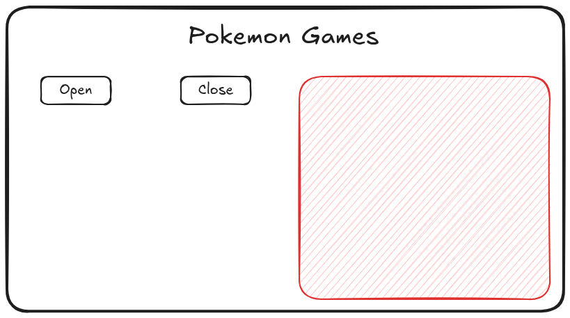

# Travaux pratiques 1 - Javascript

## Notes

### Objectifs

1. Travailler la syntaxe de JS
2. Manipuler le DOM
3. Travailler avec l'asynchrone
   1. Utiliser fetch
   2. Pratiquer async/await
4. Travailler avec les imports

### Brainstorm

- Ajout d'un élément dans le DOM avec du JS
- Changement du style via un ajout/suppression d'une classe
- Récupérer les données d'une API, et les injecter dans le DOM
  - L'API de pokémon et en faire une liste ?
  - Utiliser une autre API => Elle doit être gratuite et libre d'utilisation (pas de clé).
- Structurer son code en plusieurs fichiers qui sont des modules JS.
- Générer un tableau ou une liste

## Sujet

Travailler avec `https://pokeapi.co/api/v2/version`

### Exercice 1 - Préparatifs

Préparer un fichier HTML qui correspondra à ce design:

### Exercice 2 - Dynamisme

On va animer un peu tout ça :

1. Au chargement de la page, la zone rouge n'est pas affichée
2. 