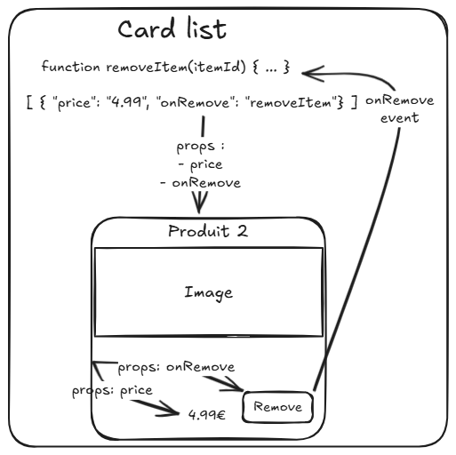

# Intéractions entre composants

---

## Structure

Un composant est souvent un regroupement de composants.


---

## Problème

On a besoin d'un mécanisme qui nous permette de faire passer des informations d'un composant père vers un composant fils, et parfois inversement.

---

## Flux de données - schéma



---

## Flux de données - règle

1. Les données vont toujours des parents vers les enfants, jamais dans le sens inverse. Cela se fait avec des propriétés (props).  
2. L'enfant peut émettre un évènement (event) pour faire remonter une action ou ... un évènement vers un composant parent.

---

## Définition des props - côté composant

Liste les props utilisée

```javascript
// Person.js
<script setup>
import { compute } from 'vue';

const props = defineProps(['firstName', 'birthDate', 'lastName'])

const fullname = compute(() => `${props.firstname} ${props.lastname}`)
</script>

<template>
    <h2>{{ fullname }}</h2>
    <p>{{ birthDate }}</p>
</template>
```

---

## Définition des props - côté parent

```javascript
// List.js
<script setup>
import { ref } from 'vue';
import Person from './Person';

const list = ref([{ firstName: "John", birthDate: "10/05/2000", lastName: "Doe" }])
</script>

<template>
    <Person v-for="person in list"
        :firstName="person.firstName"
        :lastName="person.lastName"
        :birthDate="person.birthDate"
    />
</template>
```

---

## Définition d'un évènement - côté composant

```javascript
// Counter
<script setup>
defineProps(['text'])
defineEmits(['onClick'])
</script>

<template>
    <button @click='$emit('onClick')'>{{ text }}</button>
</template>
```

---

## Définition d'un évènement - côté composant dans le script

```javascript
// ButtonAction
<script setup>
defineProps(['text'])
const emits = defineEmits(['onClick'])

function click(_event) {
    emit('onClick');
}
</script>

<template>
    <button @click='click'>{{ text }}</button>
</template>
```

---

## Définition d'un évènement - côté parent

```javascript
// Counter
<script setup>
import { ref } from 'vue';
import ButtonAction from 'ButtonAction';

const counter = ref(0);
</script>

<template>
    <p>{{ counter }}</p>
    <ButtonAction title="Click" @onClick="increment"/>
</template>
```
